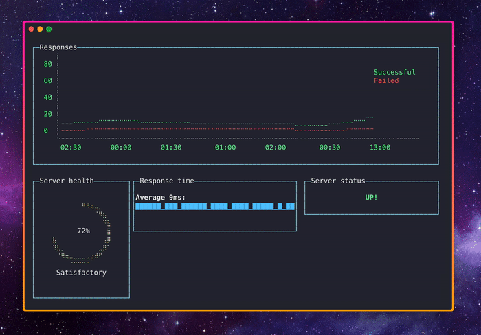

# minidash

<p align="center">
  Small terminal-based dashboard to monitor your server.
</p>

<p align="center">
  
</p>

# About

`minidash` is a small dashboard that runs in your command-line, it has a health check script that pings the server a couple times per minute and logs each request that are later displayed in a few charts.

# Running

You can run it with the following command:

```sh
npx @lucasbento/minidash --server https://google.com/ [options]
```

To see a list of the available options:

```sh
npx @lucasbento/minidash --help
```

# Installation

`minidash` uses [`yarn`] as package manager, simply run the following to install the dependencies:

```sh
yarn install
```

# Testing

The tests are written using Jest, you can run them with:

```sh
yarn test
```

[`yarn`]: https://yarnpkg.com/
